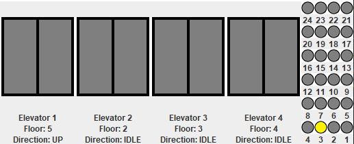
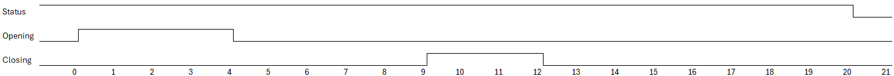
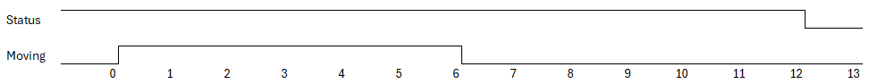

# SYSC 3303 Elevator Project Iteration 5
## Group 9
Joseph Vretenar 101234613<br>
Samuel Mauricla - 101233500<br>
Bhavaan Balasubramaniam - 101233825

## Breakdown of the tasks:

Joseph Vretenar - Coded ElevatorSubsystem, Scheduler, Event, Direction, and FloorSubsystem, Created the Timing Diagrams.<br>
Samuel Mauricla - Coded FloorSubsystemTest, reviewed other code and documentation.<br>
Bhavaan Balasubramaniam - Wrote README.md, reviewed the Timing Diagram.<br>

## Project Iteration 5 : Capacity limits and User Interface
The purpose of Iteration 5 was to implement a display console to show all the elevators in real-time as well as display any faults that occur. In addition, to implement a capacity limit to ensure an elevators carries no more than the maximum capacity.

## Files:
### [FloorSubsystem.java](src/FloorSubsystem.java)
The Floor class will extract data from an input file and parses each line to create an 'Event' object.
In addition, it will incorporate timestamps, the current floor, movement direction, and the destination floor.

### [Scheduler.java](src/Scheduler.java)
The Scheduler class is reponsible for managing elevator requests.
The requests are pending and completed requests.
It consists of methods such as adding, processing, and completing events, ensuring there's thread-safe interactions.
The 'run' method checks for accurate simulation of elevator movements and waiting periods.
It ensures for fault detection and handling within the program.
Graphic User Interface(GUI) is used to display information corresponding to the status of the elevators.

### [Event.java](src/Event.java)
The Event class is responsible for maintaing elevator-related events which consists of timestamp (time), current floor (currentFloor), movement direction (move), and requested destination floor (destinationFloor).

### [ElevatorSubsystems.java](src/ElevatorSubsystem.java)
The Elevator Subsystems class is repsonsible for the elevator's movement and responses to scheduler events.
Some methods that are there include 'Runnable' which handles the Elevator's movements and tracks down the amount of passenger to drop and pick up. The 'move' method checks the floor movement and updates the current floor and progress regarding that.

### [Direction.java](src/Direction.java)
The Direction class consists of three constants UP,DOWN and IDLE.
The constants represent the different possible number of states the Elevator is currently in.
'Enum' represents what direction the floor is in or if its in an IDLE state.

## Setup Instructions
1. Ensure Java is installed on your system
2. Compile the Java files either using an IDE or through command lines
3. Ensure that the input file is in the same Project folder
4. To run the simulation, the files must be run in the following order:<br>
   a. ElevatorSubsystems.java<br>
   b. Scheduler.java<br>
   c. FloorSubsystem.java<br>

To edit the floors and requests, edit the inputFile.txt file

## GUI

This graphical user interface makes it easier to track elevator and floor operations. It displays elevators and their corresponding floors, providing consumers a clear image. However, it is important to realize that the interface is primarily for cosmetic reasons; the buttons are not clickable. They present a simulated elevator and floor options. The right half of the GUI provides buttons for each floor. The button will turn yellow to indicate that the request has been registered. They serve to show the concept of floor selection. Meanwhile, the left side tracks elevator movements and updates their positions, levels, and orientations in real time. The interface allows users to monitor elevator operations and simulate floor selections.




## Testing
1. Open the project in your preferred IDE.
2. Make sure JUnit is installed on your system. If not, download and install it.
3. Make sure Jupiter is installed on your system. If not, download and install it.
4. Run the files in the following order:<br>
   a. ElevatorSubsystems.java<br>
   b. SchedulerTest.java<br>
   c. FloorSubsystem.java<br>

## Expected Output
### Simulation
When running the simulation, the output should show up on four different console windows, each corresponding to the file that was run.
The output for the ElevatorSubsystems should look like this:
```
Elevator 1 is waiting at 1
Elevator 2 is waiting at 2
Elevator 3 is waiting at 3
Elevator 4 is waiting at 4
Elevator 1 is moving to request floor
Elevator 1 has arrived at the request floor
Elevator 1 is picking up passenger
Elevator 1 is moving to destination floor
Elevator 1 moved to floor 2
Elevator 1 moved to floor 3
Elevator 3 is moving to request floor
Elevator 3 has arrived at the request floor
Elevator 3 is picking up passenger
Elevator 1 moved to floor 4
Elevator 1 moved to floor 5
Elevator 3 is moving to destination floor
Elevator 1 moved to floor 6
Elevator 1 has arrived at destination
Elevator 1 is dropping off passenger
Elevator 3 moved to floor 2
Elevator 3 moved to floor 1
Elevator 3 has arrived at destination
Elevator 3 is dropping off passenger
Sending response time: 12:0:47 as fc02f1
Elevator 1 is waiting at 6

Elevator 2 is moving to request floor
Elevator 2 has arrived at the request floor
Elevator 2 is picking up passenger
Sending response time: 12:0:59 as fc03b3
Elevator 3 is waiting at 1
```
The output for the Scheduler should look like this:
```
Received request from floor subsystem on floor: 1
Forwarding request to elevator subsystem at: 12:0:0
Received request from floor subsystem on floor: 3
Forwarding request to elevator subsystem at: 12:0:30
Received response from elevator subsystem at: 12:0:47
Confirming completion with floor subsystem
Received request from floor subsystem on floor: 2
Forwarding request to elevator subsystem at: 12:1:0
Received response from elevator subsystem at: 12:0:59
Confirming completion with floor subsystem

```
The Output for the FloorSubsystem should look like this:
```
Sent request: Sat Mar 23 12:00:00 EDT 2024 1 UP 6 as 0c00010601
Sent request: Sat Mar 23 12:00:30 EDT 2024 3 DOWN 1 as 0c01e030100
Received confirmation of completed Request from elevator 1
Sent request: Sat Mar 23 12:01:00 EDT 2024 2 UP 8 as 0c10020801
Received confirmation of completed Request from elevator 3
Sent request: Sat Mar 23 12:01:30 EDT 2024 4 DOWN 1 as 0c11e040100
```

### Testing
When running the Scheduler test case, the output will catch assertions that are checking if the requests
were made in a timely manner, the expected will always be false and the test will pass if the output is true.
```
Received request from floor subsystem on floor: 1
Forwarding request to elevator subsystem at: 12:0:0
Assertion passed: expected: <false> but was: <true>
Elevator 1 is taking too long to close doors, potential error
Assertion passed: expected: <false> but was: <true>
Elevator 1 is taking too long to close doors, potential error
Assertion passed: expected: <false> but was: <true>
Elevator 1 is taking too long to close doors, potential error

```
This shows the requests that were made, when they were completed based on the current time, and the output should have no errors. If the output has an error then the test has failed.

## Timing Diagrams:
There were 2 possible scenarios for Timing Diagrams:<br>
Terminologies:<br>
1. Status - Checks for Fault Detection<br>
2. Opening - Checks the time for doors to open<br>
3. Closing - Checks the time for doors to close<br>
4. Moving - Checks the time for elevators to traverse through different floors<br>

### Doors stuck
The purpose of this scenario will measure the time it takes for an elevator to open and close its doors within 1 full duration. More specifically,
the time it takes to open doors is 4 seconds, it takes 3 seconds for the doors to close. Status will change from 1 to 0 after 8 seconds, if the doors
have not reported that they closed.


### Elevators moving getting stuck 
The purpose of this scenario is to measure the time it takes for an elevator to traverse through floors and getting stuck during that process. 
More specifically, it would measure the status which would ensure a drop 12s to check for faults. The system will normally take 6 seconds to move between floors,
so if the system doesn't return a new floor after 6 extra seconds, it will be considered stuck.


## Diagrams:

The UML diagram for this project can be found using this [link](Interation1ClassDiagram.png):

The Sequence diagram for all the classes and functions can be found using this [link](SequenceDiagrams):

The State Machine diagram for the ElevatorSubsytem and Scheduler can be found using this [link](StateMachineDiagrams):


